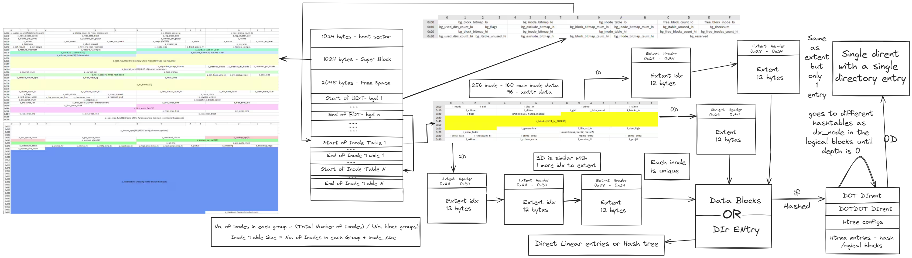

```
          
        ▄▄▄██████▀▀██████▄▄▄                                An Ext4 File System Parser
    ▄███▀█▄     ▄  ▄     ▄█▀███▄                     Tool to Parse Linux and Android FileSystems
  ██▀█▄████     ████     ████▄█▀██    ███████╗██╗  ██╗████████╗██╗  ██╗    ██████╗  █████╗ ██████╗ ███████╗███████╗██████╗
▄█▀▄███████▄▄ ▄▄████▄▄ ▄▄███████▄▀█▄  ██╔════╝╚██╗██╔╝╚══██╔══╝██║  ██║    ██╔══██╗██╔══██╗██╔══██╗██╔════╝██╔════╝██╔══██╗
██ ██████████████████████████████ ██  █████╗   ╚███╔╝    ██║   ███████║    ██████╔╝███████║██████╔╝███████╗█████╗  ██████╔╝
██ ██████████████████████████████ ██  ██╔══╝   ██╔██╗    ██║   ╚════██║    ██╔═══╝ ██╔══██║██╔══██╗╚════██║██╔══╝  ██╔══██╗
▀██▀████▀ ▀▀█▀ ▀▀██▀▀ ▀█▀▀ ▀████▀██▀  ███████╗██╔╝ ██╗   ██║        ██║    ██║     ██║  ██║██║  ██║███████║███████╗██║  ██║
  ██▄█▀█▄        ▀▀        ▄█▀█▄██    ╚══════╝╚═╝  ╚═╝   ╚═╝        ╚═╝    ╚═╝     ╚═╝  ╚═╝╚═╝  ╚═╝╚══════╝╚══════╝╚═╝  ╚═╝
    ▀███▄▄▄              ▄▄▄███▀        A Complete Ext4 File System Parser built by Azr43lKn1ght(Nithin Chenthur Prabhu)
        ▀▀▀██████████████▀▀▀                                   https://github.com/Azr43lKn1ght
```

## Introduction
Ext4 File System Parser is a tool to parse Ext4 File System of Android and Linux. This tool can be used to extract file system information, superblock information, group descriptor information, inode information, directory information, file information, symbolic link information, block information, extent information, indirect block information, extended attribute information and hashtree directory structure parsing.

## Installation
```bash
git clone https://github.com/Azr43lKn1ght/ext4parser.git
cd ext4parser
pip install -r requirements.txt
python3 ext4parser.py -h
```

## How EXT4 is structured?


## What this parser can do:
- Parse Ext4 File System of Android and Linux
- Extract File System Information
- Extract Superblock Information
- Extract Group Descriptor Information
- Extract Inode Information
- Extract Directory Information
- Extract File Information
- Extract Symbolic Link Information
- Extract Block Information
- Extract Extent Information
- Extract Indirect Block Information
- Extract Extended Attribute Information
- Hashtree directory structure parsing 

## To Do:
- Add support for parsing journal
- Add support for decrypting android File Based Encryption
- Add support for parsing ext4 encryption metadata

## about the author
- Azr43lKn1ght
- LinkedIn: [Nithin Chenthur Prabhu](https://www.linkedin.com/in/azr43lkn1ght)
- X: [Azr43lKn1ght](https://x.com/Azr43lKn1ght)